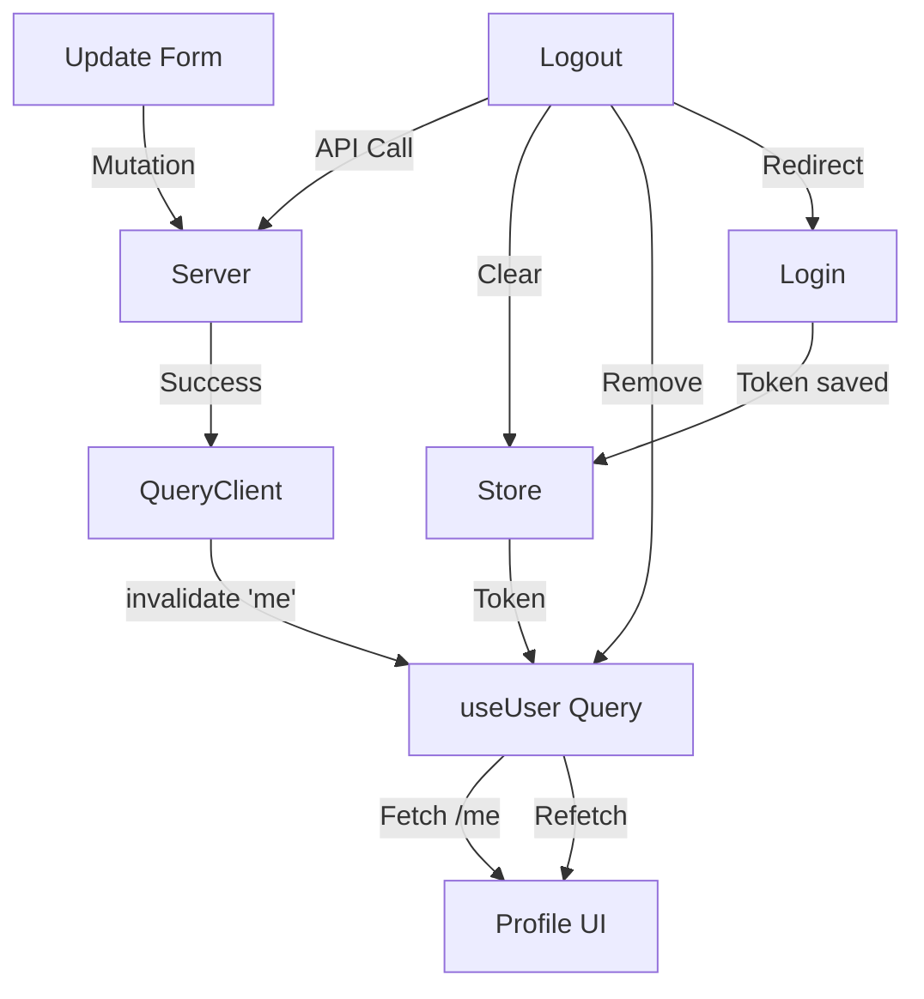

# LESSON PLAN: SESSION 12 - PROFILE FLOWS (CRUD)

## 1️⃣ SESSION OVERVIEW
- **Title:** Identify Yourself: Profile & Updates
- **Duration:** 120 minutes (2 hours)
- **Goal:** Students will implement the full user lifecycle: View Profile (Query), Update Info (Mutation + Invalidation), Change Password, and Logout.
- **Outcome:** A functional Profile Dashboard where users can see their info, edit it, and secure their account.

## 2️⃣ INSTRUCTOR OPENING SCRIPT
_"Chào các bạn. Hôm qua chúng ta đã vào được nhà (Login). Hôm nay chúng ta sẽ trang trí lại căn phòng của mình (Profile).

Session này cực kỳ quan trọng vì nó chứa đựng tinh hoa của React Query: **Invalidation**.
- Khi bạn sửa tên, làm sao cái Header nó tự đổi tên theo?
- Khi bạn Logout, làm sao đảm bảo người sau không thấy thông tin của bạn?

Hôm nay ta sẽ học cách điều khiển dòng chảy dữ liệu đó. Không cần F5, mọi thứ tự cập nhật."_

> **🔥 WHY THIS SESSION EXISTS?**
> _"Profile là tính năng 'Hello World' của mọi ứng dụng CRUD. Nếu làm tốt phần này, các bạn có thể làm bất kỳ tính năng quản lý nào (Quản lý sản phẩm, đơn hàng...) vì logic y hệt."_

## 3️⃣ MENTAL MODEL & CONCEPTUAL FOUNDATION

### ♻️ Stale-While-Revalidate (Ôn tập)
- **Problem:** Update tên xong, cache cũ vẫn còn tên cũ.
- **Solution:** `invalidateQueries(['me'])`.
- **Analogy:** Giống như xả nước bồn cầu. Dữ liệu cũ trôi đi, React Query tự động bơm nước mới (fetch API) vào.

### 🛡️ Authentication Init Flow (Vá lỗ hổng Session 11)
- **Problem:** F5 trang -> Mất user info trong Store -> App tưởng chưa Login.
- **Solution:** Khi App mới load (Mount), đọc Token từ LocalStorage để khôi phục trạng thái.

## 4️⃣ LIVE CODING – STEP BY STEP

### PHASE 1: AUTH INITIALIZATION (20 mins)
*Fix vấn đề F5 mất trạng thái đăng nhập.*

#### ⏱️ TIMELINE
- **00-10’:** Explain F5 Problem + LocalStorage
- **10-20’:** Implement Initialization Logic in Store

#### Step 1: Update Auth Store
Open `src/stores/auth.store.ts`:

```ts
// ... imports

// Instructor Explain: "Ta cần đảm bảo khi F5, nếu có token trong localStorage thì isAuthenticated = true ngay lập tức."
// Note: Vì ta đã dùng middleware 'persist', nó tự làm việc này 90%.
// Tuy nhiên, ta cần chắc chắn là 'user' object cũng được fetch lại.

// Instructor Script: "Các bạn kiểm tra xem middleware persist đã bọc store chưa. Nếu rồi thì F5 sẽ không mất token."
```

#### Step 2: Ensure `/me` Query runs on mount
Open `src/App.tsx`:
**Instructor Script:**
_"Ta sẽ dùng hook `useUser` (Query) như một cái 'heartbeat'. Chỉ cần có token, nó sẽ tự chạy để lấy thông tin user mới nhất."_

```tsx
// src/App.tsx
import { useUser } from '@/hooks/useUser';
import { useAuthStore } from '@/stores/auth.store';

function App() {
  const accessToken = useAuthStore(s => s.accessToken);

  // Instructor Script: "Chỉ cần có token thì ta gọi useUser. Không có token thì hook sẽ không chạy (enabled: false)."
  useUser({
    enabled: !!accessToken, 
  });

  return (
      <RouterProvider router={router} />
  );
}
```

---

### PHASE 2: VIEW PROFILE (30 mins)

#### Step 1: Create Profile Page
Create `src/pages/ProfilePage.tsx`:

```tsx
import { useUser } from '@/hooks/useUser'; // Hook đã viết ở Session 09
import { Button } from '@/components/ui/button';

export default function ProfilePage() {
  // Instructor Explain: "Gọi hook này. Nếu có data -> Show. Nếu đang load -> Show Skeleton."
  const { data: user, isLoading } = useUser();

  if (isLoading) return <div>Loading Profile...</div>;

  return (
    <div className="max-w-2xl mx-auto p-4">
      <div className="flex items-center gap-4">
        {/* Avatar Placeholder */}
        <div className="w-20 h-20 bg-gray-200 rounded-full flex items-center justify-center">
          {user?.name?.[0]?.toUpperCase()}
        </div>
        <div>
          <h1 className="text-2xl font-bold">{user?.name}</h1>
          <p className="text-gray-500">{user?.email}</p>
        </div>
      </div>
      
      {/* Actions */}
      <div className="mt-8 flex gap-4">
         <Button>Edit Profile</Button>
         <Button variant="outline">Change Password</Button>
      </div>
    </div>
  );
}
```

**🚦 MID-SESSION CHECKPOINT**
- Login xong -> Vào `/me` -> Thấy tên & email mình.
- F5 trang -> Vẫn thấy tên & email (không bị đá ra login).
- Console không đỏ.

---

### PHASE 3: UPDATE PROFILE & INVALIDATION (45 mins)

#### Step 1: Update API
Open `src/features/auth/auth.api.ts`:

```ts
// Instructor Script: "Thêm API update. Nhớ là method PUT nhé."
export const authApi = {
  // ... login, register
  updateMe: (body: any) => apiClient.put('/users/me', body),
};
```

#### Step 2: Create Update Mutation
Open `src/features/auth/useAuth.ts` (hoặc tạo file mới `useUpdateProfile.ts`):

```tsx
export const useUpdateProfile = () => {
  const queryClient = useQueryClient();

  return useMutation({
    mutationFn: authApi.updateMe,
    onSuccess: () => {
      // Instructor Script: "Đây là dòng quan trọng nhất buổi học!"
      // Explain: "Báo cho Query biết: Dữ liệu 'me' cũ rồi. Đi lấy cái mới đi."
      queryClient.invalidateQueries({ queryKey: ['me'] });
      toast.success("Cập nhật thành công!");
    },
  });
};
```

#### Step 3: Implement Form
**Instructor Script:**
_"Lưu ý: Form update khác form create. Ta cần điền sẵn dữ liệu cũ vào. React Hook Form cần `reset` để làm việc này khi data async về trễ."_

```tsx
// src/features/auth/components/UpdateProfileForm.tsx
// ... imports

export const UpdateProfileForm = () => {
    const { data: user } = useUser();
    const updateMutation = useUpdateProfile();

    const { register, handleSubmit, reset } = useForm({
        defaultValues: {
            name: user?.name || '',
            bio: user?.bio || '',
            // ...
        }
    });

    // Instructor Explain: "Reset form không phải để đẹp, mà để đồng bộ với server. Khi user load xong, form tự điền vào."
    useEffect(() => {
        if (user) {
            reset(user);
        }
    }, [user, reset]);

    // ... render form
}
```

---

### PHASE 4: CHANGE PASSWORD & LOGOUT (25 mins)

#### Step 1: Logout Logic (Full Clean)
Open `src/components/layouts/MainLayout.tsx` (Nơi đặt nút Logout):

```tsx
const logoutMutation = useMutation({
  mutationFn: authApi.logout, // Gọi API logout để backend xóa refresh token
  onSuccess: () => {
    // Instructor Warn: "Thứ tự quan trọng: Xóa Store -> Xóa Cache -> Redirect"
    clearAuth(); // Xóa Zustand
    
    // Instructor Note: "removeQueries() chỉ xóa cache hiện tại trong memory. Nếu sau này ta config persist cache xuống đĩa, cần lệnh khác."
    queryClient.removeQueries(); 
    
    navigate('/login');
  }
});
```

### 🚫 ANTI-PATTERNS (CẤM LÀM)
- **Set lại state user bằng tay sau khi update:** `setUser({...user, name: newName})` -> **SAI**. Phải dùng `invalidateQueries` để đảm bảo dữ liệu đồng bộ với server.
- **Hard reload trang khi logout:** `window.location.reload()` -> **Kém sang**. Dùng `queryClient.removeQueries()` là đủ sạch.
- **Quên handle error update:** Nếu update tên trùng (nếu có validate unique) mà không báo lỗi -> User tưởng xong rồi.

## 5️⃣ COMMON STUDENT MISTAKES & DEBUGGING

1.  **Form không hiện dữ liệu cũ:**
    *   *Bug:* Vào trang Edit Profile nhưng các ô input trắng trơn.
    *   *Fix:* Chưa truyền `defaultValues` cho `useForm` hoặc chưa dùng `useEffect` để reset form khi data `user` load xong.
2.  **Avatar không đổi ngay:**
    *   *Bug:* Upload xong, server bảo OK, nhưng ảnh vẫn cũ.
    *   *Fix:* Browser cache ảnh theo URL. Nếu URL ảnh không đổi, browser không tải lại. Cách fix nhanh: Thêm `?t=timestamp` vào đuôi URL ảnh.

## 6️⃣ INSTRUCTOR QUESTIONS & EXPECTED ANSWERS

1.  **Q:** *"Tại sao Logout phải gọi API? Xóa token ở client là được mà?"*
    *   **A:** Để Backend hủy hiệu lực của Refresh Token. Nếu không, kẻ gian lấy trộm Refresh Token vẫn có thể xin Access Token mới được.
2.  **Q:** *"Khi nào dùng `PUT` khi nào dùng `PATCH`?"*
    *   **A:** `PUT` thường dùng để thay thế toàn bộ object. `PATCH` dùng để sửa một phần. API của mình dùng PUT cho update user.

## 7️⃣ IN-CLASS MINI TASK
**Task:** Change Password Validation.
- Tạo form đổi mật khẩu.
- Validate: `New Password` phải khác `Old Password`.
- Validate: `Confirm Password` phải khớp `New Password`.

## 8️⃣ HOMEWORK / EXTENSION TASK
**Yêu cầu:** Sidebar Navigation.
- Tạo `DashboardLayout` có Sidebar bên trái.
- Active link: Đang ở trang nào thì link đó sáng màu.
- Hiển thị Avatar nhỏ ở góc dưới Sidebar.

## 9️⃣ CHECKPOINT & EVALUATION
- **Behavior:** Update tên -> Toast xanh -> Tên ở Header tự đổi (Chứng tỏ Invalidation hoạt động).
- **Behavior:** Logout -> Bấm Back không quay lại được trang Dashboard.
- **Code:** Không dùng `window.location`.

## 🔄 PROFILE DATA FLOW SUMMARY (Instructor Recap)
_"Trước khi nghỉ, hãy nhìn lại quy trình dữ liệu của cả buổi hôm nay."_



## 🔟 TEACHING NOTES
- **Slow Down:** Khúc `defaultValues` của React Hook Form. Khi data từ API về trễ (async), `useForm` đã init với value rỗng. Cần giải thích kỹ việc dùng `useEffect` để `reset(user)` khi `user` thay đổi.
