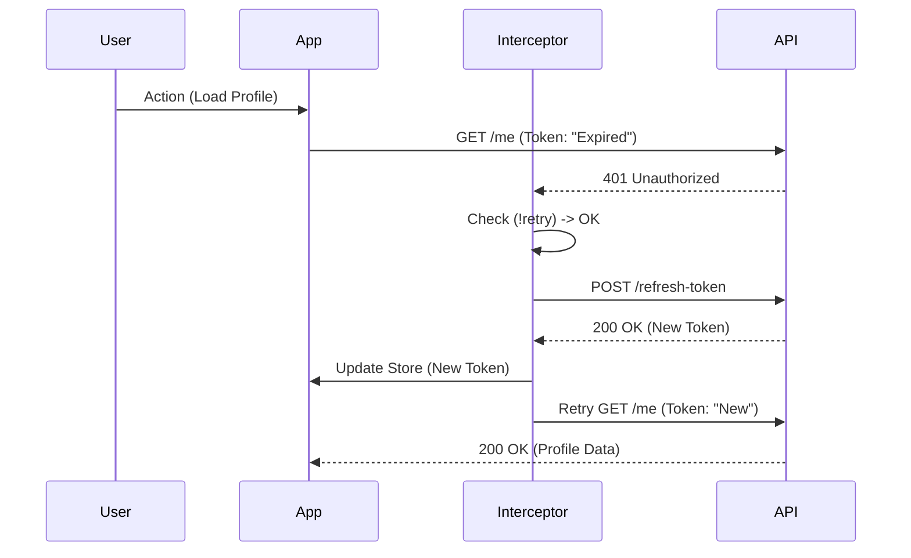

# LESSON PLAN: SESSION 13 - MEDIA UPLOAD & REFRESH TOKEN

## 1️⃣ SESSION OVERVIEW
- **Title:** Going Pro: File Uploads & Indestructible Auth
- **Duration:** 120 minutes (2 hours)
- **Goal:** Students will master handling binary data (File Uploads) and implement a robust "Silent Refresh" mechanism so users never get logged out unexpectedly.
- **Outcome:** A functioning Image Upload UI with preview, and a Network layer that automatically refreshes expired tokens transparently.

## 2️⃣ INSTRUCTOR OPENING SCRIPT
_"Chào lớp.
Hôm nay chúng ta sẽ làm 2 tính năng phân loại Senior và Junior.

Thứ nhất: **Upload Ảnh**.
Gửi Text (JSON) thì dễ rồi. Nhưng gửi một file binary (ảnh, pdf) thì HTTP cần một 'phong bì' đặc biệt gọi là `FormData`. Nhiều bạn đi làm 1 năm vẫn lúng túng chỗ này.

Thứ hai: **Refresh Token**.
Đây là tính năng 'sát thủ'. Nếu Access Token hết hạn (thường là 15-30p), người dùng reload trang mà bị văng ra Login -> App dở tệ.
Hôm nay ta sẽ dạy cho Axios biết 'tự hồi sinh':
Thấy lỗi 401 -> Âm thầm xin token mới -> Tự gọi lại API cũ -> User không hề hay biết."_

> **🔥 WHY THIS SESSION EXISTS?**
> _"Đây là buổi khó nhất về logic mạng (Network Logic). Nhưng nếu vượt qua được, các bạn có thể tự tin nói mình hiểu sâu về HTTP và Authentication."_

## 3️⃣ MENTAL MODEL & CONCEPTUAL FOUNDATION

### 📦 FormData (Cỗ xe tải)
- **JSON:** Giống như gửi thư tay. Nhẹ, nhanh.
- **FormData:** Giống như xe container. Chở được hàng nặng (Binary files). Browser tự đóng gói, ta không cần `JSON.stringify`.

### 🔄 Silent Refresh Flow
- **Scenario:** Bạn đang xếp hàng mua vé (API Call).
- **Problem:** Vé của bạn hết hạn (Token Expired, 401).
- **Solution (Interceptor):**
  1. Bảo vệ cổng (Interceptor) chặn bạn lại.
  2. "Đợi chút, để tao đi xin vé mới".
  3. Gọi API `/refresh-token` -> Có vé mới.
  4. Đưa vé mới cho bạn -> Bạn vào cổng lại như chưa có gì xảy ra.

## 4️⃣ LIVE CODING – STEP BY STEP

### PHASE 1: MEDIA UPLOAD (50 mins)

#### Step 1: Media API Setup
Open `src/lib/api/media.api.ts` (Create new):

```ts
import apiClient from "@/lib/http/apiClient";

export const mediaApi = {
  upload: (file: File) => {
    // Instructor Script: "Chú ý: Không gửi object JSON thường. Phải dùng FormData."
    const formData = new FormData();
    formData.append('image', file); // 'image' là key mà Backend quy ước. Sai là lỗi 400.

    // Instructor Note: "Tuyệt đối KHÔNG tự set Content-Type: multipart/form-data. Hãy để Axios và Browser tự làm việc đó (tự thêm boundary). Nếu tự set sẽ bị lỗi boundary."
    return apiClient.post('/medias/upload-image', formData);
  },
};
```

#### Step 2: Upload Component
Create `src/components/common/ImageUpload.tsx`:
**Instructor Script:**
_"Ta làm một component input file nhưng có ảnh preview xịn xò."_

```tsx
import { useState } from 'react';

// Instructor Explain: "Component này nhận vào hàm onFileSelect để trả file ra ngoài cho cha xử lý."
interface Props {
  onFileSelect: (file: File) => void;
}

export const ImageUpload = ({ onFileSelect }: Props) => {
  const [preview, setPreview] = useState<string | null>(null);

  const handleChange = (e: React.ChangeEvent<HTMLInputElement>) => {
    const file = e.target.files?.[0];
    if (!file) return;

    // 1. Tạo preview cục bộ (Local URL) ngay lập tức
    const objectUrl = URL.createObjectURL(file);
    setPreview(objectUrl);

    // 2. Bắn file ra ngoài
    onFileSelect(file);
  };

  // Instructor Explain: "Dọn dẹp bộ nhớ. Nếu không revoke, mỗi lần chọn ảnh là RAM tăng lên một chút -> Memory Leak."
  useEffect(() => {
    return () => {
      if (preview) {
        URL.revokeObjectURL(preview);
      }
    };
  }, [preview]);

  return (
    <div className="flex flex-col gap-2">
      {preview && }
      <input type="file" accept="image/*" onChange={handleChange} />
    </div>
  );
};
```

#### Step 3: Integration
Use this in `src/pages/ProfilePage.tsx` to upload avatar.

**🚦 MID-SESSION CHECKPOINT**
- Chọn ảnh -> Thấy ảnh hiện lên (Preview).
- Bấm Save -> Network tab báo upload thành công (200 OK).
- Response trả về URL ảnh từ server (vd: `http://api.../uploads/xyz.jpg`).

---

### PHASE 2: REFRESH TOKEN INTERCEPTOR (60 mins)

#### Step 1: The Concept
Open `src/lib/http/apiClient.ts`.
**Instructor Script:**
_"Quay lại `apiClient`. Đây là nơi ma thuật xảy ra. Ta sẽ sửa `response.use`."_

#### Step 2: Coding the Interceptor
**Instructor Note:** Code này rất dễ loop vô hạn. Gõ chậm từng dòng.

```ts
// ... imports
import { authApi } from '@/features/auth/auth.api';

// Instructor Explain: "Biến này để tránh việc 10 API 401 cùng gọi refresh 1 lúc. Chỉ 1 thằng gọi thôi."
let refreshTokenRequest: Promise<any> | null = null;

apiClient.interceptors.response.use(
  (response) => response,
  async (error) => {
    const originalRequest = error.config;

    // 0. Chặn loop vô hạn: Nếu chính request refresh token bị lỗi thì DỪNG LẠI NGAY.
    if (originalRequest.url.includes('/auth/refresh-token') || originalRequest.url.includes('/users/refresh-token')) {
        useAuthStore.getState().clearAuth();
        window.location.href = '/login';
        return Promise.reject(error);
    }

    // 1. Check điều kiện: Lỗi 401 VÀ chưa từng retry
    if (error.response?.status === 401 && !originalRequest._retry) {
      originalRequest._retry = true; // Đánh dấu đã thử 1 lần

      try {
        // 2. Gọi Refresh Token
        // Instructor Explain: "Nếu đã có ai đó đang gọi refresh, ta dùng chung promise đó luôn (Singleton)."
        if (!refreshTokenRequest) {
           refreshTokenRequest = authApi.refreshToken({
              refresh_token: useAuthStore.getState().refreshToken
           });
        }
        
        const { data } = await refreshTokenRequest;
        
        // 3. Reset promise
        refreshTokenRequest = null;

        // 4. Lưu token mới
        useAuthStore.getState().setTokens(data.result.access_token, data.result.refresh_token);

        // 5. Gắn token mới vào header request cũ
        originalRequest.headers.Authorization = `Bearer ${data.result.access_token}`;

        // 6. Gọi lại request cũ
        return apiClient(originalRequest);

      } catch (refreshError) {
        // 7. Nếu Refresh cũng lỗi (Hết hạn cả 2) -> Logout
        // Instructor Warn: "Đây là đường cùng. Hết cứu -> Đá ra Login."
        refreshTokenRequest = null;
        useAuthStore.getState().clearAuth();
        
        // Instructor Explain: "Tại sao dùng window.location mà không dùng navigate? Vì Interceptor này nằm ngoài React Component Tree. Hơn nữa, reload trang giúp clear sạch memory để user làm lại từ đầu."
        window.location.href = '/login'; 
        return Promise.reject(refreshError);
      }
    }

    return Promise.reject(error);
  }
);
```

#### Step 3: Testing Strategy (The "Hacker" Way)
**Instructor Script:**
_"Làm sao test? Chẳng lẽ ngồi đợi 30 phút cho token hết hạn?
Không. Ta sẽ hack.
1. Mở DevTools -> Application -> LocalStorage.
2. Tìm `access_token`. Sửa sai 1 ký tự cuối (thành `x` chẳng hạn).
3. F5 trang hoặc bấm nút gọi API.
4. Xem Network tab:
   - Request 1: 401 (Đỏ)
   - Request 2: `/refresh-token` (200 OK)
   - Request 3: Request 1 được gọi lại (200 OK)
Nếu thấy chuỗi này: Chúc mừng, bạn đã thành công!"_

## 🚫 ANTI-PATTERNS (CẤM LÀM)
- **Tự set `Content-Type: multipart/form-data`:** Đừng khôn hơn trình duyệt. Hãy để nó tự làm.
- **Không clean `URL.createObjectURL`:** Theo lý thuyết thẻ nhớ sẽ bị đầy nếu tạo quá nhiều preview.
- **Interceptor Loop:** Nếu không check `url.includes('/refresh-token')`, interecptor sẽ gọi refresh -> fail -> lại vào interceptor -> gọi refresh -> ... Vô tận -> Treo trình duyệt.
- **Refresh đồng thời:** Nếu 5 API cùng fail 401, không được gọi 5 lần refresh. Phải dùng Promise Singleton để xử lý.

## 5️⃣ COMMON STUDENT MISTAKES & DEBUGGING

1.  **Gửi sai key `FormData`**: Backend chờ key `image` nhưng frontend gửi `file` hoặc `avatar` -> Lỗi 422 Unprocessable Entity.
2.  **Quên header `multipart/form-data`**: Axios thông minh tự detect được, nhưng nếu tự set `Content-Type: application/json` thì sẽ lỗi.
3.  **Lỗi 401 Loop**: Nhìn Console thấy request đỏ lòm nhảy liên tục hàng trăm cái.
    *   *Fix:* Tắt tab ngay lập tức. Kiểm tra logic `_retry` flag.

## 🔄 REFRESH TOKEN FLOW DIAGRAM


## 🧠 REFRESH TOKEN MENTAL CHECKLIST
_"Trước khi đóng dõng, hãy tick vào mental checklist của mình."_

- [ ] Access Token ngắn hạn (15-30p).
- [ ] Refresh Token dài hạn.
- [ ] Interceptor bắt 401.
- [ ] `_retry` flag chặn loop (cho request thường).
- [ ] `url.includes` chặn loop (cho chính request refresh).
- [ ] Singleton Promise (chặn refresh đồng thời).
- [ ] Retry request cũ trong im lặng.

## 🏁 CLOSING MOTIVATION
_"Nếu bạn hiểu và tự code lại được buổi hôm nay, bạn **KHÔNG** còn là Junior React nữa. Logic này là tiêu chuẩn của Senior Frontend ở mọi công ty lớn. Về nhà hãy thử xóa code Interceptor đi và tự viết lại từ đầu."_

## 🔟 TEACHING NOTES
- **Slow Down:** Phần Interceptor cực kỳ khó hiểu về luồng chạy (Async/Await trong Callback). Hãy vẽ hình lên bảng hoặc dùng diagram trên để chỉ từng bước.
- **Emphasis:** Nhấn sâu vào chi tiết "User Experience". User không hề biết token hết hạn. Đó là sự kỳ diệu của "Silent Refresh".
